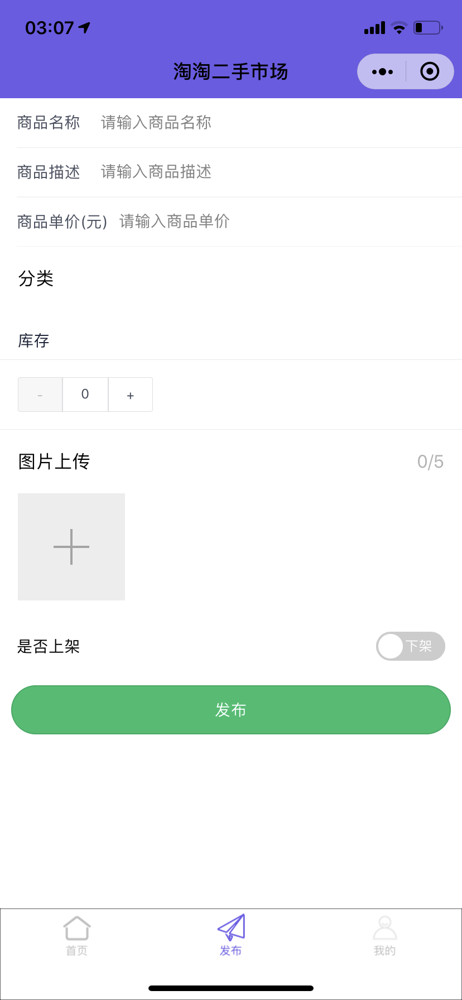

# 介绍

淘淘二手市场

## 技术选型

### 前端

1. IView
2. WeUI
3. JavaScript

### 后端

1. 微信小程序云开发

## 开发工具

1. 微信开发者工具
2. WebStorm 2020.3.3

## 规范

前后端代码中采用小驼峰命名法，数据库采用蟒蛇命名法

## 演示

  
   
  
  
  

## 参考文档

- [微信开发文档](https://developers.weixin.qq.com/miniprogram/dev/wxcloud/basis/getting-started.html)
- [云开发文档](https://developers.weixin.qq.com/miniprogram/dev/framework/)
